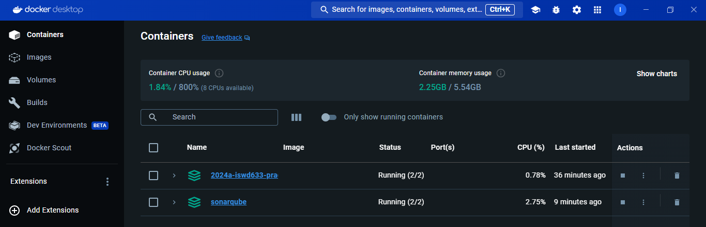
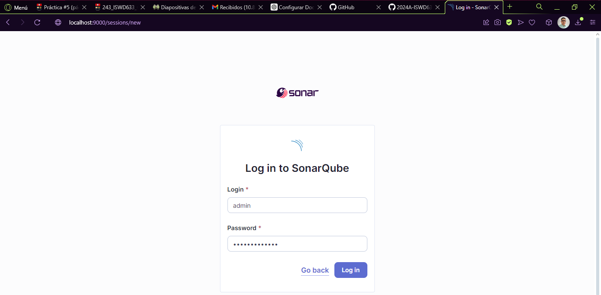
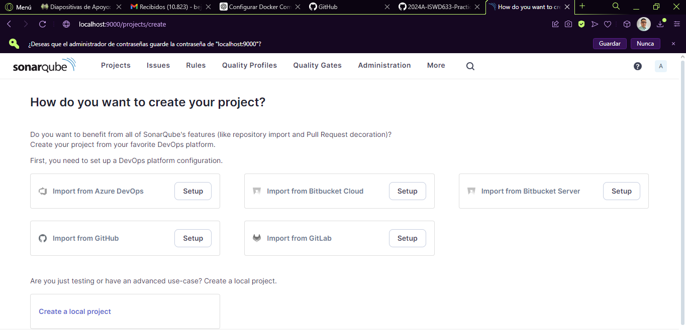

# Ejercicio
Configurar SonarQube utilizando Docker Compose, para esto necesitas dos servicios:
- Servicio: SonarQube
- Desde el host es necesario acceder a SonarQube por lo que necesitas mapear el puerto correspondiente.
- Servicio: PostgreSQL (existen otras opciones: Microsoft SQL Server, Oracle)
- Coloca un healtcheck para cada uno de los servicios.
- Los dos servicios deben pertenecer a uan red de tipo bridge
- Investiga cuáles son los volúmenes necesarios para cada servicio
- Investiga cuáles son las variables de entorno para que los servicios funcionen de manera adecuada.

# Resolución Ejercicio

El archivo .yaml se encuentra en la carpeta SonarQube, es el archivo docker-compose.yaml


Se ejecuta el siguiente comando:
``` bash
docker compose ps
```



Y al momento de ingresar a la web `localhost:9000` se muestra esto y se puede ingresar con las credenciales por defecto: `admin`, `admin`.



Y al momento de ingresar nos muestra para cambiar la contraseña por defecto.

Al momento ya ingresado nos muestra la siguiente pantalla.
